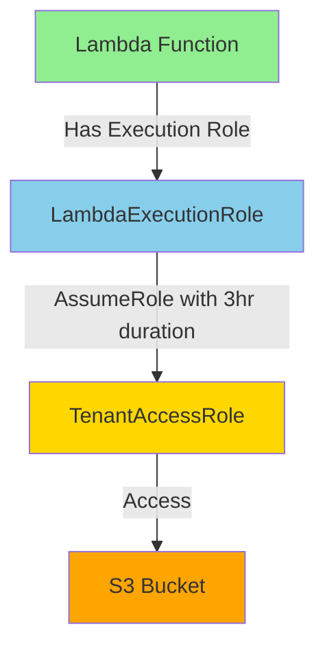
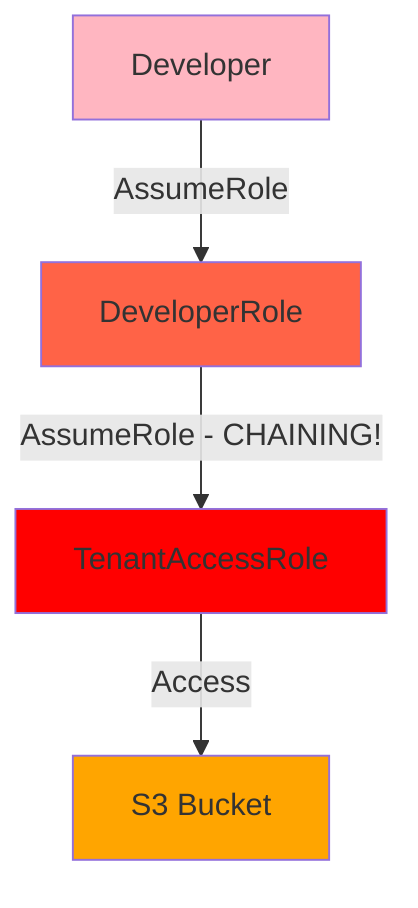
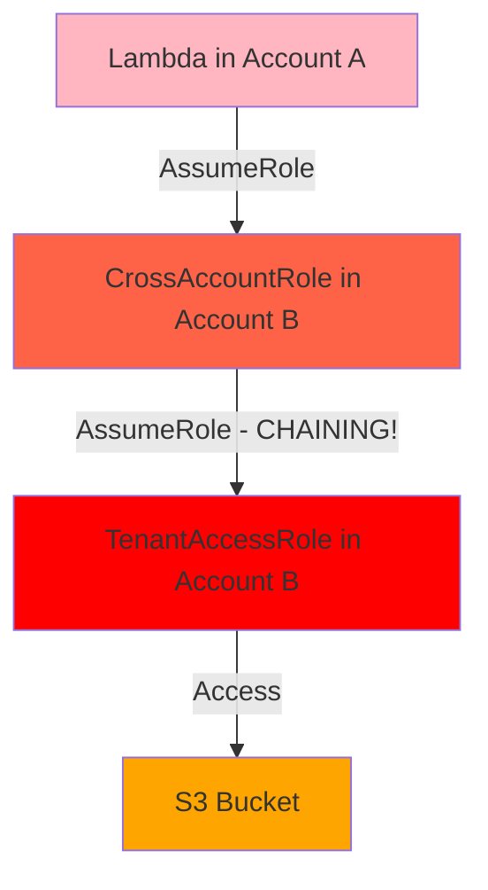

# Role Chaining vs Direct Assume Role

## Our Architecture (No Role Chaining) ✅

**Result:** ✅ Can use 3-hour sessions

## Colleague's Possible Architecture (Role Chaining) ❌

### Scenario 1: Local Development

**Result:** ❌ Limited to 1-hour sessions

### Scenario 2: Cross-Account

**Result:** ❌ Limited to 1-hour sessions

## Key Differences

| Aspect | Our Setup | Colleague's Setup |
|--------|-----------|-------------------|
| First Principal | Lambda Execution Role (attached) | Assumed Role |
| Role Hops | 1 (direct) | 2+ (chained) |
| Max Duration | 3 hours | 1 hour |
| Error Message | None | "exceeds the 1 hour session limit" |

## How Lambda Execution Roles Work

Lambda execution roles are special:
- Directly attached to the Lambda function
- Not considered "assumed roles" for chaining purposes
- AWS Lambda service assumes the role on behalf of your function
- Credentials are injected into the Lambda environment

This is why our Lambda → TenantAccessRole is NOT role chaining!